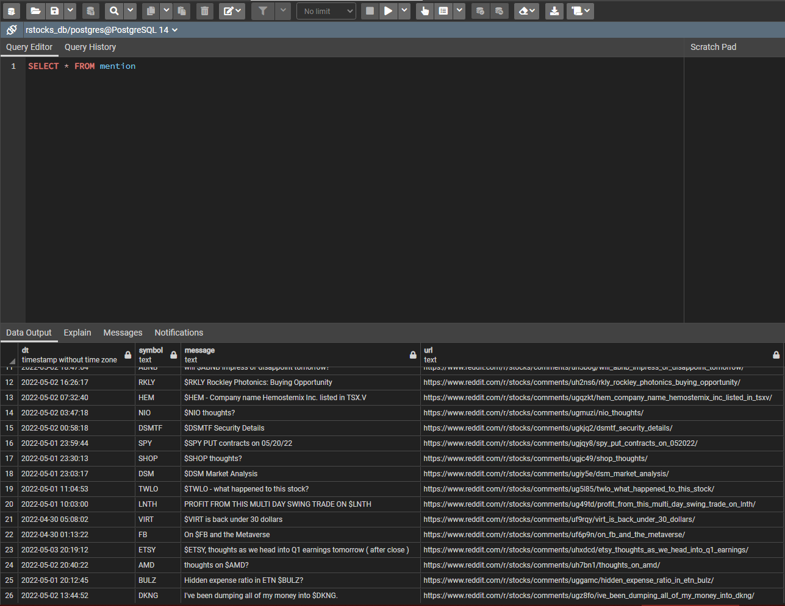
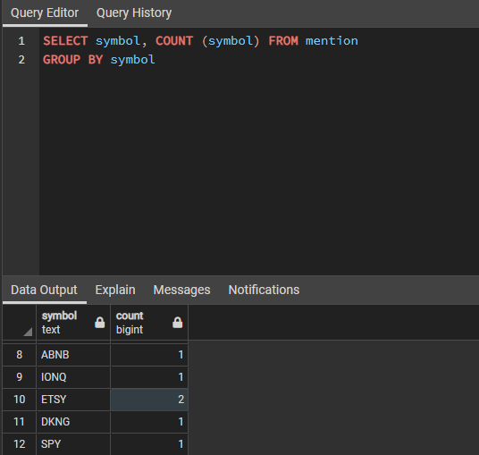

# rStocks-Mentions-Tracker

This program allows the user to scrape subreddits for cashtags. The cashtags will be placed into a SQL database where the user is free to analyse the data to their liking. 

